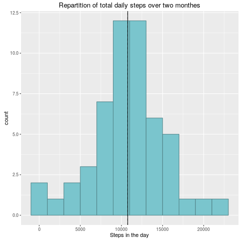
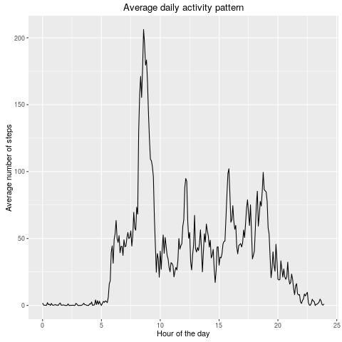
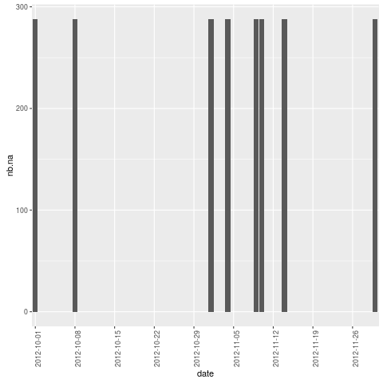
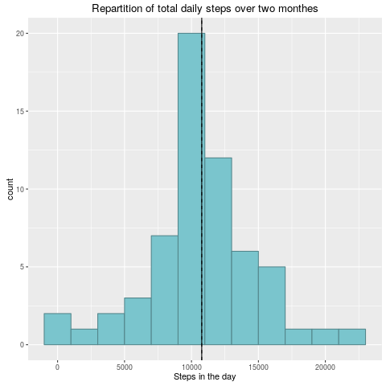
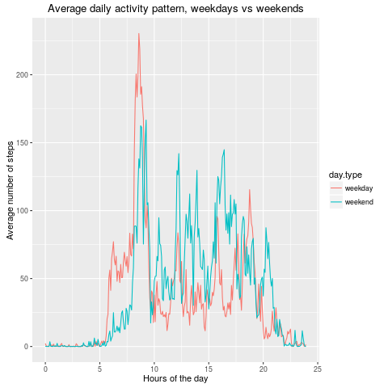

# Activity Monitoring - Peer Assignment
Valérie Mauduit  
28 novembre 2016  


I loaded libraries: dplyr and ggplot, but code and messages are hidden.

## Introduction

This work is based on data from an anonimous monitoring device. This device collects data at 5 minute intervals through out the day. The data consists of two months of data from an anonymous individual collected during the months of October and November, 2012 and include the number of steps taken in 5 minute intervals each day.

Data are loaded in a dataframe named *activity*:


```r
activity <- read.csv("activity.csv")
```

The variables included in this dataset are:

* *steps*: Number of steps taking in a 5-minute interval  
* *date*: The date on which the measurement was taken in YYYY-MM-DD format  
* *interval*: Identifier for the 5-minute interval in which measurement was taken


```r
nbl <- nrow(x = activity)
nbl
```

```
## [1] 17568
```

```r
pna <- mean(x = is.na(activity$steps)) * 100
pna
```

```
## [1] 13.11475
```

```r
pna <- round(pna, digits = 1)
```
There are a total of 17568 observations in this dataset. But 13.1% of them are missing values. 

## Mean total number of steps taken per day

We represent here the total number of steps by day. 


```r
total.steps.per.day <- 
    activity %>% 
    group_by(date) %>% 
    summarize(daily_steps = sum(steps))

mean.steps.per.day <- 
    mean(total.steps.per.day$daily_steps, na.rm = TRUE)
print(mean.steps.per.day)
```

```
## [1] 10766.19
```

```r
median.steps.per.day <- 
    median(total.steps.per.day$daily_steps, na.rm = T)
print(median.steps.per.day)
```

```
## [1] 10765
```


```r
png(filename = "figures/plot1.png")
ggplot(total.steps.per.day, aes(daily_steps)) +
    geom_histogram(binwidth = 2000, na.rm = TRUE,
                   fill = "CadetBlue3", 
                   col = "CadetBlue4") +
    geom_vline(xintercept = median.steps.per.day) +
    geom_vline(xintercept = mean.steps.per.day, linetype = 2) +
    labs(x = "Steps in the day",
         title = "Repartition of total daily steps over two monthes")
dev.off()
```

 

The median total steps by day is 10765, represented as a solid vertical line in the histogram.  
The mean total steps by day is 1.0766189\times 10^{4}, represented as a dashed vertical line in the histogram, but we don't see it because it is very close to the median value.

## Average daily activity pattern

We make a serie representing the average number of steps, 5-min by 5-min.

We also need to be careful: interval time aren't provided in min, but in numeric format representing hour+min, i.e. "625" value represents 6:25:00 for exemple. So we have to convert it into time.


```r
steps.pattern <-
    activity %>%
    group_by(interval) %>%
    summarize(avg.steps = mean(steps, na.rm = T))

min2time <- function(x) {
    y <- sprintf("%04.0f", x)
    hms(paste(substr(y, 1, 2), substr(y, 3, 4), "00", sep = ":"))
}
steps.pattern <- mutate(steps.pattern, hour = min2time(interval))
```


```r
png(filename = "figures/plot2.png")
ggplot(steps.pattern, 
       aes(hour(hour) + minute(hour)/60, avg.steps)) +
    geom_line() +
    labs(x = "Hour of the day", y = "Average number of steps",
         title = 'Average daily activity pattern')
dev.off()
```

 


```r
max.avg.steps.interval <- 
    steps.pattern$hour[which.max(steps.pattern$avg.steps)]
max.avg.steps.interval
```

```
## [1] "8H 35M 0S"
```

The 5-minute interval, on average across all the days in the dataset, containing the maximum number of steps is the one which begins at 8:35 am.

## Imputing missing values

There are a number of missing values which may introduce bias into some calculations or summaries of the data. So we will study the N.A. (missing values) pattern.


```r
nb.na <- sum(is.na(activity$steps))
nb.na
```

```
## [1] 2304
```

```r
pc.na <- round(mean(is.na(activity$steps)) * 100, digits = 1)
pc.na
```

```
## [1] 13.1
```

There are 2304 N.A. values in the dataset, i.e. 13.1% of the measured values. How are the filled?

We start by a look at a time-in-the-day filling pattern of N.A. values:


```r
steps.pattern2 <-
    activity %>%
    group_by(interval) %>%
    summarize(nb.na = sum(is.na(steps)))
min(steps.pattern2$nb.na)
```

```
## [1] 8
```

```r
max(steps.pattern2$nb.na)
```

```
## [1] 8
```

There are exactly 8 missing values for each min-interval. Are there on the same days?


```r
steps.pattern3 <-
    activity %>%
    group_by(date) %>%
    summarize(nb.na = sum(is.na(steps)))
min(steps.pattern3$nb.na)
```

```
## [1] 0
```

```r
max(steps.pattern3$nb.na)
```

```
## [1] 288
```

There is at least one day fully missing, as 288 is the number of 5-min intervals in 24h.


```r
unique(steps.pattern3$nb.na)
```

```
## [1] 288   0
```

We see that even a day is full of measurements, or there are no values. So we look after empty days:


```r
png(filename = "figures/plot3.png")
ggplot(steps.pattern3, aes(x = date, y = nb.na)) +
    geom_bar(stat = "identity") +
    scale_x_discrete(breaks = steps.pattern3$date[seq(1, 61, by = 7)]) +
    theme(axis.text.x = element_text(angle = 90))
dev.off()
```

 


```r
dates.na <- steps.pattern3$date[steps.pattern3$nb.na == 288]
dates.na
```

```
## [1] 2012-10-01 2012-10-08 2012-11-01 2012-11-04 2012-11-09 2012-11-10
## [7] 2012-11-14 2012-11-30
## 61 Levels: 2012-10-01 2012-10-02 2012-10-03 2012-10-04 ... 2012-11-30
```

Days which have no measurments are: October 1st and 8th, and November 1st, 4th, 9th, 10th, 14th and 30th.

We create a new dataset that is equal to the original dataset but with the missing data filled in with mean measured value:


```r
activity.full <- activity
activity.full$steps[is.na(activity.full$steps)] <- 
    rep(steps.pattern$avg.steps, 8)

total.steps.per.day.new <- 
    activity.full %>% 
    group_by(date) %>% 
    summarize(daily_steps = sum(steps))

mean.steps.per.day.new <- mean(total.steps.per.day.new$daily_steps)
print(mean.steps.per.day.new)
```

```
## [1] 10766.19
```

```r
median.steps.per.day.new <- median(total.steps.per.day.new$daily_steps)
print(median.steps.per.day.new)
```

```
## [1] 10766.19
```


```r
png(filename = "figures/plot4.png")
ggplot(total.steps.per.day.new, aes(daily_steps)) +
    geom_histogram(binwidth = 2000, na.rm = TRUE,
                   fill = "CadetBlue3", 
                   col = "CadetBlue4") +
    geom_vline(xintercept = median.steps.per.day.new) +
    geom_vline(xintercept = mean.steps.per.day.new, linetype = 2) +
    labs(x = "Steps in the day",
         title = "Repartition of total daily steps over two monthes")
dev.off()
```

 

Median value changed due to filling of missing values.

## Are there differences in activity patterns between weekdays and weekends?

We create two new variables: *day.week* which is the day of the week for each date, and *day.type* which indicates wether it is a weekend or a weekday.


```r
activity.full <- mutate(activity.full, 
                        day.week = factor(weekdays(as.Date(date))))
activity.full <- mutate(activity.full, 
                        day.type = factor(ifelse(
                            day.week %in% c("dimanche", "samedi"),
                            "weekend", 
                            "weekday")))
activity.full <- mutate(activity.full, 
                        nb.min = (60*(interval%/%100)+interval%%100))

steps.pattern.week <- 
    activity.full %>% 
    group_by(nb.min, day.type) %>% 
    summarize(avg.steps = mean(steps))
```


```r
png(filename = "figures/plot5.png")
ggplot(steps.pattern.week, 
       aes(nb.min/60, avg.steps, col = day.type)) +
    geom_line() +
    labs(x = "Hours of the day", y = "Average number of steps",
         title = 'Average daily activity pattern, weekdays vs weekends')
dev.off()
```

 

We can see that on week days, steps increase earlier than on weekends. But after, during the days, there are more steps on weekends days.
